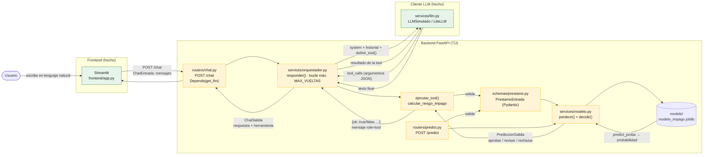

# Objetivo semana 8 - Chatbot de riesgo (FastAPI + LLM + modelo)

```mermaid
flowchart LR
    U([Usuario]) -->|escribe en lenguaje natural| F

    subgraph FRONT["Frontend (hecho)"]
        F["Streamlit<br/>frontend/app.py"]
    end

    F -->|"POST /chat<br/>ChatEntrada: mensajes"| C

    subgraph BACK["Backend FastAPI (TÚ)"]
        C["routers/chat.py<br/>POST /chat<br/>Depends(get_llm)"]
        O["services/orquestador.py<br/>responder() · bucle máx. MAX_VUELTAS"]
        T["ejecutar_tool()<br/>calcular_riesgo_impago"]
        P["schemas/prestamo.py<br/>PrestamoEntrada (Pydantic)"]
        M["services/modelo.py<br/>predecir() + decidir()"]
        J[("models/<br/>modelo_impago.joblib")]
        PR["routers/predict.py<br/>POST /predict"]
    end

    subgraph LLMBOX["Cliente LLM (hecho)"]
        L["services/llm.py<br/>LLMSimulado / LiteLLM"]
    end

    C --> O
    O -->|"system + historial + definir_tool()"| L
    L -->|"tool_calls (argumentos JSON)"| O
    O --> T
    T -->|valida| P
    P --> M
    M --> J
    J -->|"predict_proba → probabilidad"| M
    M -->|"PrediccionSalida<br/>aprobar / revisar / rechazar"| T
    T -->|"{ok: true/false, ...}<br/>mensaje role=tool"| O
    O -->|resultado de la tool| L
    L -->|texto final| O
    O -->|"ChatSalida<br/>respuesta + herramienta"| C
    C --> F

    PR -->|valida| P
    PR --> M

    classDef hecho fill:#e6f4ea,stroke:#2e7d32,color:#1b1b1b
    classDef tuyo fill:#fff4d6,stroke:#FAB900,color:#1b1b1b
    class F,L hecho
    class C,O,T,P,M,PR tuyo
```
